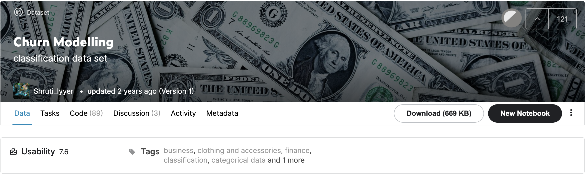

# churn-modelling-Kaggle (IN DEVELOPMENT)
Analysis of churns from a bank using dataset [Kaggle](https://www.kaggle.com/shrutimechlearn/churn-modelling)

### Content
This data set contains details of a bank's customers and the target variable is a binary variable reflecting the fact whether the customer left the bank (closed his account) or he continues to be a customer.

## Tools
- Python
- Jupyter Notebook

## The problem: Churn

% churn = n customer that canceled the service at a month / n of clients in the beginning of the month

**How to reduce the churn?**

1- identify the best customers and focus on them

- which customers canceled the contract?

- which customer are in risk of cancel the contract?

2- follow the churn daily and identify the reasons

3- deliver properly the product and give a quality service

4- show the customer is important

## Variables:

- RowNumber
- CustomerId
- Surname
- CreditScore
- Geography (country)
- Gender (female, male)
- Age
- Tenure (the time of bond with company)
- Balance
- NumOfProducts (number of products)
- HasCrCard (has credit card)
- IsActiveMember
- EstimatedSalary
- Exited (churn, TARGET)

## EDA - Exploratory Data Analysis

## Conclusion